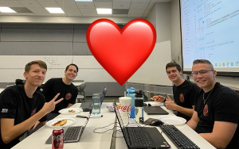

# Home Care Analysis

For Home Care Pulse

Repo for our hackathon October 2022 project

Made with ❤️ by Team Fresh Meat

# Requirements

## Python Packages: 

- PyInstaller
- PySimpleGUI
- Prophet
- webbrowser
- Altair
- Vega_Datasets

It should run in a Python environment just fine given these packages are installed. However, compiling is a little bit hacky, but it works!

## Compiling for Windows:

On Windows machine: `pyinstaller hc-analysis.spec` from within the repo's folder

> Note: You may get an error related to manually importing Prophet or vega-datasets, this is due to the fact that we added the whole libraries to the repo to be manually included (related to a bug with pyinstaller not automatically detecting their uses). You can fix this by replacing them with a copy of your installation of Prophet and vega-datasets in the "manual-imports" folder (usually found in `C:\Users\\[$USER]\AppData\Local\Programs\Python\Python310\Lib\site-packages` on Windows)

# Contributors

- [Kent Barnhurst](https://github.com/OddPanda3) - Popcorn, Moral support, Ideas
- [Preston Corless](https://github.com/pgattic) - GUI, Compiling, Technical support
- [Bryant Van Orden](https://github.com/SupermanIsMeYes) - Implementation of data analysis libraries
- [Jack West](https://github.com/Jwesterner) - Project management
